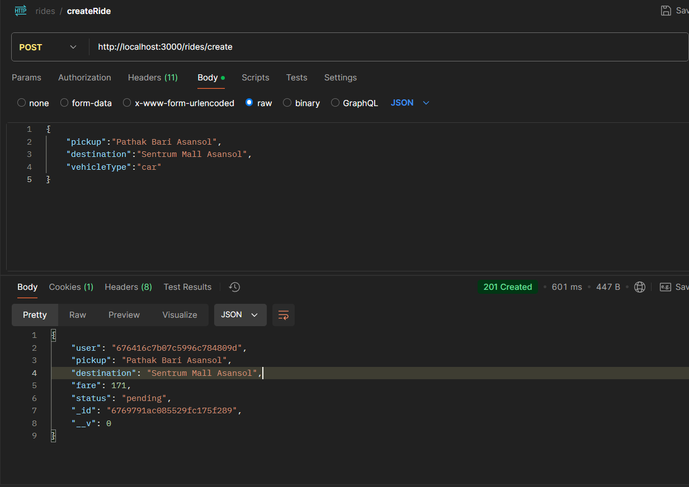
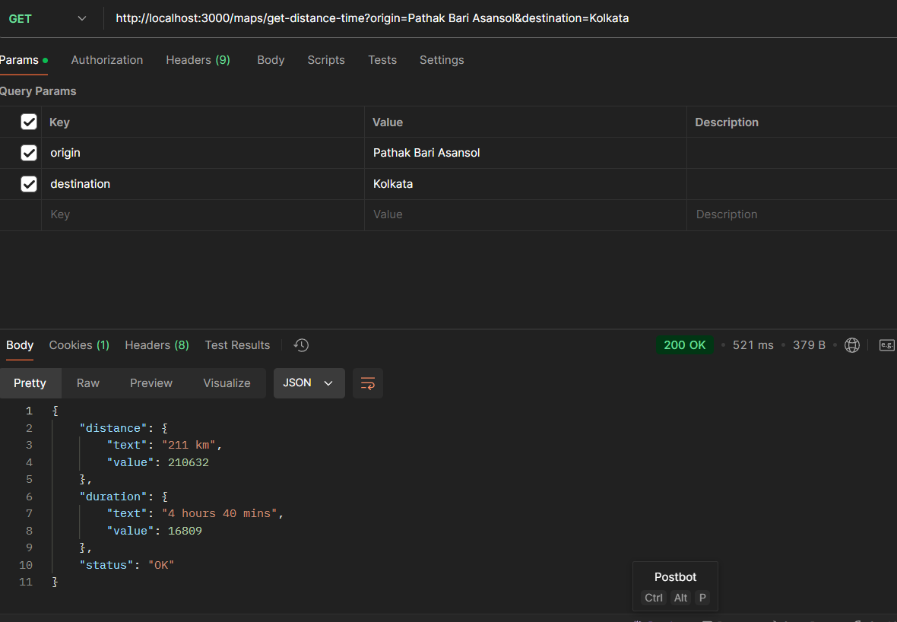

# CABPOINT

## Project Overview

CABPOINT is a comprehensive backend API for a ride-sharing application that connects users with captains. The platform facilitates user registration, captain onboarding, ride creation, fare estimation, and real-time ride management using Socket.io. It also integrates geographical coordinate services to enhance location-based functionalities.

## Features

### User Management
- **User Registration:** Allows users to create an account with firstname, lastname, email, and password.
- **User Login:** Authenticates users and provides a JWT token for secure access.
- **User Profile:** Retrieves authenticated user’s profile information.
- **User Logout:** Invalidates user sessions securely.

### Captain Management
- **Captain Registration:** Enables captains to register with detailed vehicle information.
- **Captain Login:** Authenticates captains and provides a JWT token.
- **Captain Profile:** Retrieves authenticated captain’s profile details.
- **Captain Logout:** Securely logs out captains by invalidating their tokens.

### Ride Management
- **Create Ride:** Allows users to request a new ride by specifying pickup and destination addresses along with vehicle type.
- **Fare Estimation:** Provides fare estimates based on pickup and destination locations.
- **Confirm Ride:** Enables captains to accept and confirm ride requests.

### Geographical Services
- **Get Coordinates:** Retrieves geographical coordinates for a specified address.
- **Get Distance and Time:** Calculates distance and estimated travel time between two locations.
- **Autocomplete Suggestions:** Provides place name suggestions based on user input.

### Real-Time Communication
- **Socket.io Integration:** Facilitates real-time notifications for new rides and ride confirmations between users and captains.

## API Endpoints

### Users
- `POST /users/register` - Register a new user.
- `POST /users/login` - User login.
- `GET /users/profile` - Get user profile.
- `GET /users/logout` - User logout.

### Captains
- `POST /captains/register` - Register a new captain.
- `POST /captains/login` - Captain login.
- `GET /captains/profile` - Get captain profile.
- `GET /captains/logout` - Captain logout.

### Rides
- `POST /rides/create` - Create a new ride.
- `GET /rides/fare` - Get fare estimation.
- `POST /rides/confirm` - Confirm a ride.

### Maps
- `GET /maps/get-coordinates` - Get geographical coordinates.
- `GET /maps/get-distance-time` - Get distance and travel time.
- `GET /maps/getAutoCompleteSuggestions` - Get autocomplete suggestions.

## Getting Started

### Prerequisites
- Docker
- Node.js and npm

### Environment Variables

Create a `.env` file in the project root and add the following variables:

```bash
PORT=3000
MONGO_URI=your_mongodb_uri
JWT_SECRET=your_jwt_secret
COOKIE_SECRET=your_cookie_secret
GOOGLE_MAPS_API_KEY=your_google_maps_api_key
```

### Using Docker

```bash
docker-compose up
```

### Using NPM

```bash
npm install
node server.js
```

## Technologies Used
- **Backend:** Node.js, Express.js, Docker
- **Database:** MongoDB
- **Real-Time Communication:** Socket.io
- **Geocoding Services:** Google Maps API
- **Authentication:** JWT, Cookies, Cookie-Parser

## Contributing
Contributions are welcome! Please fork the repository and submit a pull request.

## API Screenshots





